# Bird Bend Stand — Operator manual

| | |
|---|---|
| Version | 1.0 (2026-10-08) — PC application SW 0.1.0, FW 0.2.0, baseline SRS v0.6.4 / ICD v0.7.4 |
| Audience | Lab operators of the bend (pull / push) test stand |
| Owner | Implementer D (GUI); safety texts follow `00_System/specs/SRS.md` §2, §3.2, §8.1 and `00_System/specs/DECISIONS.md` |
| Short form | [`QUICK_REFERENCE.md`](QUICK_REFERENCE.md) — one page: stops and clears, start-up and pre-test checklists |

Screenshots: generated offscreen from the real application connected to the built-in FW simulator
(`03_SW/tests/gui/manual_screenshots.py`; Windows fonts loaded explicitly). Values in the pictures (forces, positions,
dates) come from the simulator, not from a real stand. In the screenshots the Pause/Break key is switched off
(KEY chip red "UNAVAILABLE"); on the lab PC it normally shows "REGISTERED".

Texts in **bold** or in `code` are the exact labels you see in the application.

---

## Contents
1. [Safety first](#1-safety-first)
2. [Installation](#2-installation)
3. [The main window](#3-the-main-window)
4. [First start: connect and check the board configuration](#4-first-start-connect-and-check-the-board-configuration)
5. [First use without calibration: no-specimen mode](#5-first-use-without-calibration-no-specimen-mode)
6. [Driver enable and homing](#6-driver-enable-and-homing)
7. [Manual control](#7-manual-control)
8. [Travel calibration](#8-travel-calibration)
9. [Load calibration with 1 kg + 10 kg](#9-load-calibration-with-1-kg--10-kg)
10. [Tare](#10-tare)
11. [Safety limits](#11-safety-limits)
12. [Test marks](#12-test-marks)
13. [Realtime plots, readouts and event log](#13-realtime-plots-readouts-and-event-log)
14. [Recording and Take sample](#14-recording-and-take-sample)
15. [Sequences](#15-sequences)
16. [Reports](#16-reports)
17. [Troubleshooting](#17-troubleshooting)
18. [Files and folders](#18-files-and-folders)
19. [Appendix A — indicator chips](#19-appendix-a--indicator-chips)
20. [Appendix B — screenshot list](#20-appendix-b--screenshot-list)

---

## 1. Safety first

### 1.1 What can hurt you
- The motor and ball screw can push or pull with about **9 kN**. The load cell is rated **200 kg (1961 N)**. The
  stand can destroy the cell, the fixture and the specimen in a fraction of a second. The board stops on its own
  load limit (default 110 % FS), but keep hands out of the specimen area whenever the driver is enabled.
- The axis is **horizontal and has no brake**. When the motor is de-energised under load (red E-stop, driver
  supply off) the load can push the table back: the specimen may spring back and be released (KL-03).
- A broken specimen can release stored energy (fragments, sudden table motion up to the stop).
- The driver keeps the motor **energised and holding** after a GUI STOP, after the Pause/Break key, after PAUSE,
  after closing the application and after a board reset. "Stopped" does not mean "free".

### 1.2 The ways to stop — what each one does

| You use | Where | What happens | Driver | Latched? How to clear | Sequence |
|---|---|---|---|---|---|
| **Red E-stop button** (mushroom, turn to release) | operator panel | Board stops the pulses (≤ 100 µs) and drives ENA to *disabled* (≤ 1 ms). A second contact of the button cuts ENA **directly, without the MCU** (hardwired ENA cut, D-42). | **de-energised** — no holding torque, load may back-drive, axis **NOT homed** | **ESTOP** latched. Release the button, wait ≥ 100 ms, **Clear stop…** → tick **E-stop button released, area safe** → **Clear E-STOP**; then **Driver enabled** + **HOME** | terminated |
| **STOP** (red, on screen) | toolbar, Manual tab, Sequence tab, every plot / readout window, every dialog and wizard | Immediate stop (fires on mouse **press**). | **holding** | not latched; nothing to clear | terminated (also wizards and tare) |
| **Pause/Break** key (also **Ctrl+Break**) | keyboard, works system-wide, also when the application is not in front | **HALT**: immediate stop, sent repeatedly until the board confirms it. | **holding** | **HALT** latched. **Clear stop…** → **Clear HALT** | terminated |
| **‖ Pause** (toolbar), **‖ Pause** (Sequence tab) or the physical **PAUSE** button | screen / operator panel | Controlled (decelerated) stop; **PAUSED** blocks every new motion start. | **holding** | **PAUSED** latched. **▶ Resume** (toolbar), **Resume** (banner, Sequence tab, Manual tab) or press the PAUSE button again. **Clear stop…** → **Clear PAUSE** also clears it | **paused** — resumable. Wizards and tare are aborted (not resumable) |
| **Stop (controlled)** | Sequence tab | Controlled stop, the sequence ends STOPPED. | holding | not latched | ends STOPPED |
| **Abort (HALT)** | Sequence tab | Same as the Pause/Break key (HALT). | holding | **HALT** latched → **Clear HALT** | ends ABORTED |

Rules that always apply:
- **Use the red E-stop for an emergency** (person at risk, uncontrolled motion, smoke). Use **STOP** or
  **Pause/Break** to stop a test while keeping the specimen held.
- **No clear ever restarts motion.** After any clear the axis stays where it is until you command a new move.
- If the banner says `STOP NOT SENT …` or `… NOT CONFIRMED by the board after 1 s – use the red E-stop button.`,
  press the red E-stop.
- When the PC is busy (many plot channels and windows, a virus scan, remote-desktop software) the on-screen
  **STOP** can react noticeably later, because it waits for the application window. The **Pause/Break** key is
  handled in its own thread and stays fast; keep the number of plotted channels moderate during tests.
- The on-screen **STOP** button never takes keyboard focus: Space or Enter never trigger it, and they never
  confirm a safety question either. Confirmations need a **mouse click** (often after ticking a checkbox).
- The Pause/Break key does **not** reach windows that run "as Administrator" (KL-01). The KEY chip shows
  whether the key is active; test it with **Tools ▸ Test Pause/Break key…** (§17).

A latch is shown in the red stop banner with its clear procedure and the button **Clear stop…**:

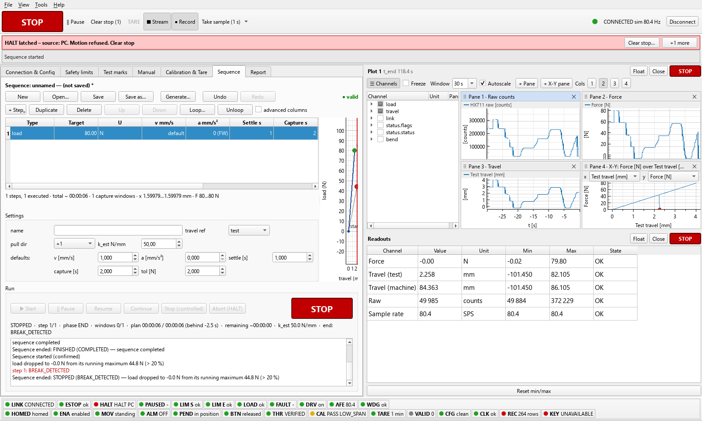

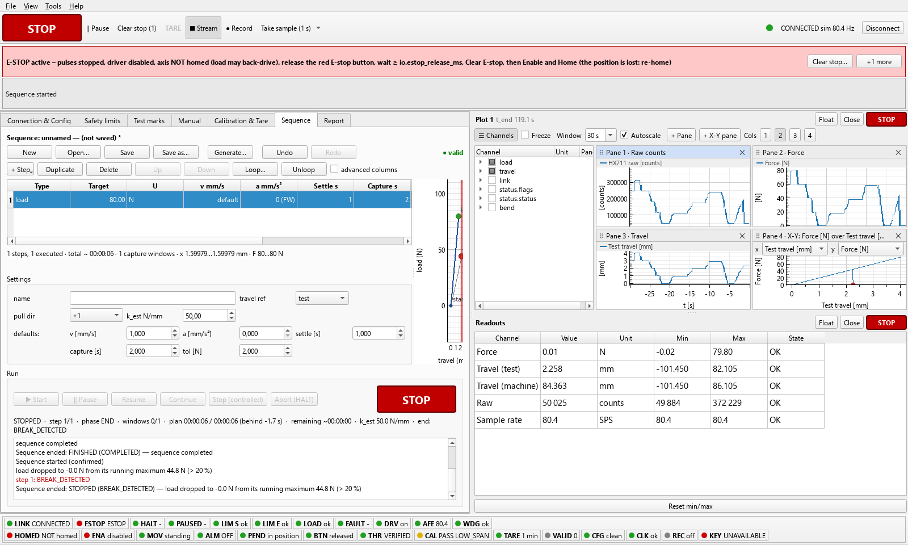

### 1.3 The red E-stop is not an IEC 60204-1 emergency stop
Since D-41 the stand has **no power-removal contactor** (KL-08). The red button stops the motion in two ways:
its NC contact tells the board (FW stop + ENA disabled), and its NO contact forces the driver's ENA input to
*disabled* directly (D-42). The 48 V supply of the driver stays on. A failure of the MCU is covered only by the
board watchdog (≤ 100 ms) and by the hardwired ENA cut. The PO accepted this residual risk.

- The hardwired ENA cut is **not monitored** (KL-09): a broken wire is not detected. **Periodic check**
  (wiring.md C-25, by a trained person): hold the Nucleo in reset (black RESET button), press the E-stop → the motor
  shaft must turn freely by hand; release → it holds again only after the board runs and the driver is enabled.
  Do this at the start of every test campaign and after any work on the operator panel (interval to be confirmed by
  the PO, see open item OI-UM-04).
- To remove all energy from the motor, switch off the 48 V driver supply (mains switch of the PSU).

### 1.4 Automatic stops

| Cause | What you see | Board / PC reaction | How to clear |
|---|---|---|---|
| Limit switch START / END | **LIM S** / **LIM E** red, `LIMIT_START` / `LIMIT_END` | immediate stop, holding | only motion **away** from the switch is accepted; the latch clears 20 ms after the switch is released |
| Both limit inputs active | both **LIM** chips red, `LIMIT_WIRING` | immediate stop | fix the wiring (§17), then **Clear faults** |
| Board load limit or ADC at its rail | **LOAD** red, `LOAD_LIMIT` | immediate stop | **Clear faults**, then move to reduce the load (it re-trips if the load grows) |
| PC (SW) load or travel limit | **LOAD** red "SW trip", banner `SW limit trip: …` | STOP, sequence terminated | move back / unload — the latch clears inside the limit |
| HX711 stale or saturated | **AFE** red | immediate stop while moving, `AFE_FAULT` | restore the HX711 (§17), **Clear faults** |
| PC link lost ≥ 1 s while moving | **WDG** red, banner `LINK LOST …` | controlled stop, holding | clears with the next frame; check the USB link (§17) |
| Sequence guard (BREAK_DETECTED, SLIP, TIMEOUT, NOT_REACHED, DRIVER_ALARM, recording failure) | red step result in the Sequence tab | STOP (controlled for ALM and recording failure), sequence STOPPED | nothing latched; read the message |
| Driver alarm | **ALM** red `ALM – new motion blocked` | a running move continues; new motion refused; a sequence stops | §17 "Driver alarm" |
| Idle ≥ 600 s with load < 2 % FS | **ENA** red `disabled`, **HOMED** red | driver disabled, axis not homed | **Driver enabled** + **HOME** |

All stops clear the board's VALID flag (data validity marker).

### 1.5 Clear stop
The toolbar button **Clear stop** shows the number of latched items, e.g. `Clear stop (2)`. It opens the
**Clear stop** window: the list of latched items with their clear procedure and one button per clear command.

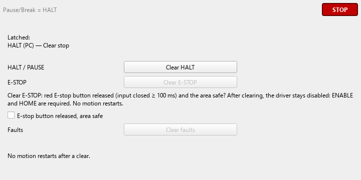

| Button | Clears | Note |
|---|---|---|
| **Clear HALT** (label **Clear HALT + PAUSE** or **Clear PAUSE** when PAUSED is latched) | HALT and PAUSED | while a sequence is paused it asks first: `Clear stop ends the paused sequence …` (use Resume to continue instead) |
| **Clear E-STOP** | ESTOP | enabled only after you tick **E-stop button released, area safe** and the button is released ≥ 100 ms. Afterwards: **Driver enabled** + **HOME** |
| **Clear faults** | `LOAD_LIMIT`, `AFE_FAULT`, `STEP_FAULT`, `LIMIT_WIRING`, `HOME_NOT_FOUND`, `HOME_WIRING`, `HOME_DRIFT`, `K1_WELDED` | refused while the cause is still present (the row says which) |

`Clear not confirmed — click again` means the answer was lost; the application never repeats a clear on its own.

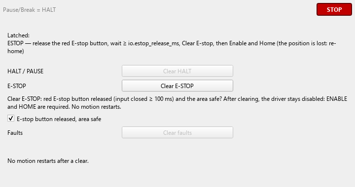

### 1.6 Known limitations (release 1, SRS §8.1)
| ID | Limitation | What you do |
|---|---|---|
| KL-01 | Pause/Break is not delivered while an elevated (Administrator) window has focus. | Use the on-screen STOP or the red E-stop. Do not run other programs as Administrator during tests. |
| KL-02 | Lost steps are reported only by the driver ALM output (closed loop) and at re-homing (`HOME_DRIFT`). | Re-home at the start of each test day; watch ALM. |
| KL-03 | No brake: when the motor is de-energised under load the table may spring back. | Expect it after an E-stop or supply loss; keep clear. |
| KL-04 | The board's fallback-clock flag is not in the data stream (GET_STATUS / event only). | CLK chip; report "HSI clock" to the maintainer. |
| KL-05 | The PAUSE button is a normally-open contact: a broken wire looks like "not pressed". | Test the PAUSE button before a test series (the BTN chip shows `PAUSE pressed`). The E-stop is the path of record. |
| KL-06 | With the optional 48 V sense, a supply loss during an NVM save is handled after the save. | Only relevant if the sense is fitted (not in release 1). |
| KL-07 | No physical holding stop: the only physical stop button (red E-stop) de-energises the motor. | Holding stops: on-screen STOP, Pause/Break key; PAUSE for a controlled pause. |
| KL-08 | No hardwired power removal: the red E-stop is not an IEC 60204-1 emergency stop. | §1.3. |
| KL-09 | The hardwired ENA cut of the E-stop is not monitored. | Periodic check §1.3. |
| — | BREAK_DETECTED at standstill is evaluated from 100 ms after the target is reached (HX711 filter lag). A break inside the first 100 ms after a move is caught only by the board load limit or as `NOT_ON_TARGET`. | — |
| — | Driver ALM / PEND are reported only (plus the ALM start block); there is no automatic board reaction to ALM. | §17 "Driver alarm". |
| — | 1 kg + 10 kg calibrate only 5 % FS (`LOW_SPAN`); forces above 3 × the largest weight are marked "extrapolated". | §9. |

### 1.7 Safe working rules
1. Before you mount a specimen: load calibration valid (**CAL** green or amber `LOW_SPAN`), **tare** done in this
   session, **THR** `VERIFIED`, PC load limits **on** (no **NOSPEC** chip), SW travel limits set.
2. Never mount a specimen in **no-specimen mode** (amber banner `NO-SPECIMEN MODE …`).
3. Keep the red E-stop within reach. Stand outside the specimen line while loading.
4. Never leave a loaded specimen unattended; after the test unload (move back) before you disable the driver.
5. Disabling the driver (**Driver enabled** unticked) removes holding torque: unload first.

---

## 2. Installation
Install the application as described in [`03_SW/packaging/README.md`](../packaging/README.md) (installer and
portable build, prepared by Implementer B). The installer creates two Start-menu entries:
- **Bird Bend Stand** — starts disconnected; you choose the board on the Connection & Config tab;
- **Bird Bend Stand (simulator)** — connects to the built-in FW simulator (training, no hardware).

From a development checkout the same is `03_SW\run.bat` and `03_SW\run_sim.bat`. Command-line options:
`--port COM7` (connect at start), `--sim` (simulator), `--session FILE.bbsession.json`, `--log-level INFO`.

The board appears as **STLink Virtual COM Port (COMn)** when the Nucleo is plugged in by USB. The application never
opens a port before you press **Connect**.

---

## 3. The main window

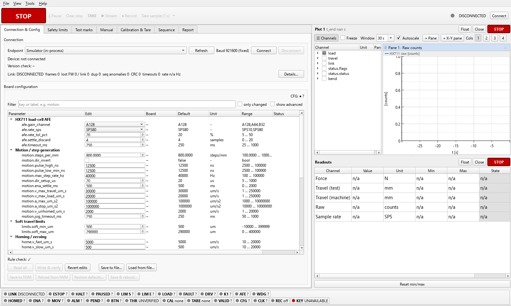

From top to bottom:
- **Toolbar** (fixed, always visible):

  

  | Item | Purpose |
  |---|---|
  | **STOP** | immediate stop, driver holding (§1.2) |
  | **‖ Pause** / **▶ Resume** | controlled pause; the text changes to **▶ Resume** while the board reports PAUSED |
  | **Clear stop** | opens the Clear stop window (§1.5); `Clear stop (n)` = n latched items |
  | **TARE** | tare from any tab (§10) |
  | **▶ Stream** / **■ Stream** | start / stop the 80 Hz data stream (it starts automatically at Connect) |
  | **● Record** | start / stop a recording (§14) |
  | **Take sample** (`Take sample (1 s)`, menu ▾ 0.1 … 10 s) | one averaged sample (§14) |
  | link LED + `CONNECTED sim 80.4 Hz` + **Connect** / **Disconnect** | link state; a click on the text opens the Connection & Config tab |

  No toolbar item has a keyboard shortcut.
- **Banners** (only while something applies): the red / amber **stop banner** (latches, faults, stop results, PAUSED,
  LINK LOST, first use), the amber **mode banner** `NO-SPECIMEN MODE …`, the **notice strip** (configuration and
  calibration notices with buttons) and a short **message line** for results ("Tare started", "Resume sent", …).
  When several stop rows apply, the most severe one is shown with **+n more**.
- **Tabs**: **Connection & Config**, **Safety limits**, **Test marks**, **Manual**, **Calibration & Tare**,
  **Sequence**, **Report**. The last tab used is restored at the next start.
- **Docks** on the right: **Plot 1** (more with **View ▸ New plot window**), **Readouts**; **Event log** at the bottom
  (hidden by default, **View ▸ Event log**). Each dock has **Float**, **Close** and its own **STOP**.
- **Indicator bar** (two rows of chips, always visible, see [Appendix A](#19-appendix-a--indicator-chips)). Grey "?" =
  state unknown, never "OK". Click a chip for its meaning and clear procedure (same as
  **Help ▸ Status indicators & clear procedures…**).

  

Menus:

| Menu | Items |
|---|---|
| File | **Open session…**, **Save session as…** (`*.bbsession.json`: limits, speeds, display unit; never tare or no-specimen mode), **Exit** (Ctrl+Q) |
| View | **New plot window** (up to 4), **Save layout now**, **Units** ▸ **N** / **kgf**, show / hide **Plot 1**…, **Readouts**, **Event log** |
| Tools | **Link statistics…**, **Test Pause/Break key…** |
| Help | **Status indicators & clear procedures…**, **Keyboard…**, **About…** (SW, FW, protocol and dictionary versions) |

Closing the window while the axis moves, a wizard / sequence runs or a recording is open asks first:
`Closing sends STOP, ends the recording and leaves the driver enabled (holding).` The application never disables the
driver on exit.

---

## 4. First start: connect and check the board configuration

1. Switch on the PC, plug in the Nucleo USB, switch on the 48 V driver supply. The driver holds the motor as soon as
   it has power (the board starts with pulses blocked and the axis **NOT homed**).
2. Start **Bird Bend Stand**. On **Connection & Config** choose the **Endpoint** (`STLink Virtual COM Port (COMn)`;
   **Refresh** re-reads the list; **Simulator (in-process)** for training) and press **Connect** (toolbar or tab).
   Baud rate is fixed at 921600.
3. Check the **Device** line (FW version, dictionary hash ✓) and `Version check: ✓ compatible`. A protocol mismatch
   makes the application **read-only** (RO chip, notice `Read-only: protocol/payload version mismatch – motion
   disabled.`): motion is impossible until FW and PC software match.
4. The **Link** line shows frames, losses and the sample rate (80 Hz expected); **Details…** opens the link
   statistics.

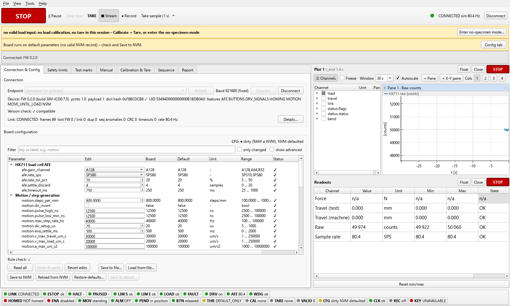

### Board configuration
The table lists every board parameter: **Edit** (your value), **Board** (value on the board), **Default**,
**Unit**, **Range**, **Status**. **Filter**, **only changed** and **show advanced** narrow the list.
- **Read all** re-reads the board. **Write & verify** writes your edits, reads them back and shows per row `✓`,
  `REJECTED`, `MISMATCH`, `REBOOT_REQUIRED` … **Revert edits** discards them. The **Rule check** line blocks
  **Write & verify** when edits break a rule.
- **Save to file…** / **Load from file…** (`*.bbboard.json`): a loaded file only fills the **Edit** column; press
  **Write & verify** to apply it.
- **Save to NVM** stores the board RAM permanently; **Reload from NVM**; **Restore defaults…** (asks first; NVM
  unchanged until Save to NVM). The CFG chip shows `dirty` while RAM ≠ NVM.
- Parameters marked reboot-required take effect after **Save & reboot…** (asks first; the axis is NOT homed
  afterwards, the driver keeps holding).
- Rows `safety.load_raw_min / max` and `safety.zero_raw` are locked: the PC manages them from calibration, tare and
  limits (§11).
- Notice `Board runs on default parameters (no valid NVM record) – check and Save to NVM.` appears on a new
  board: check the values, then **Save to NVM**.

Do not change motion or homing parameters without the maintainer; the defaults match the driver setup
(4000 pulses/rev closed loop, 800 steps/mm nominal).

---

## 5. First use without calibration: no-specimen mode
Without a load calibration and a tare in this session the PC load limits cannot be evaluated, so **all motion is
refused**. The banner says `no valid load input: no load calibration, no tare in this session – Calibrate + Tare,
or enter the no-specimen mode` with the button **Enter no-specimen mode…**.

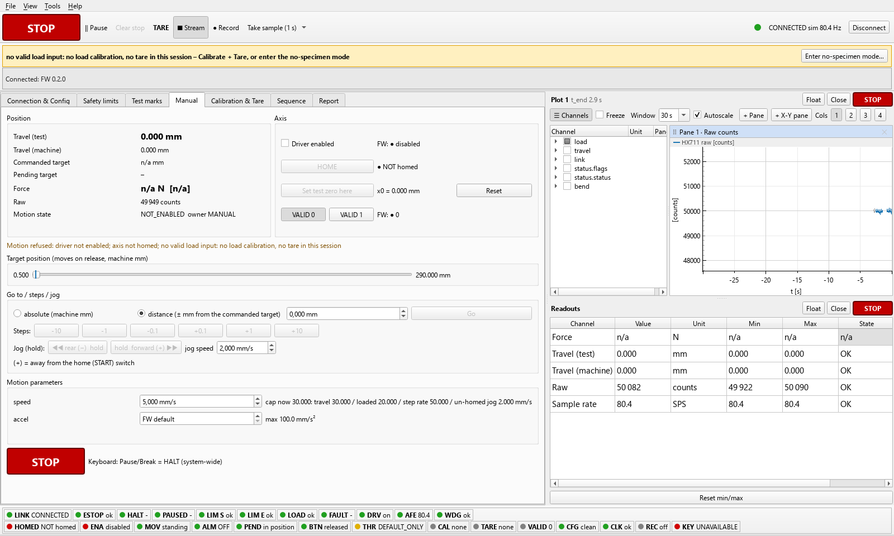

The **no-specimen mode** switches the PC load limits off **for this session only**, so you can home, run the travel
calibration and the load calibration with hanging weights. The board load limit stays active at its default
(±7 022 271 counts ≈ ±109 % FS), travel limits stay active.

1. **Safety limits** tab → **Enter no-specimen mode…** (also on the banner and on the wizard start pages).
2. Read the text, tick **No specimen is mounted**, click **Switch PC load limits off**.

   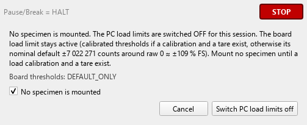
3. While the mode is on: amber banner `NO-SPECIMEN MODE – PC load limits OFF for this session …` on every tab,
   **NOSPEC** chip, an amber **NO-SPECIMEN** tag on every window. **Do not mount a specimen.**

   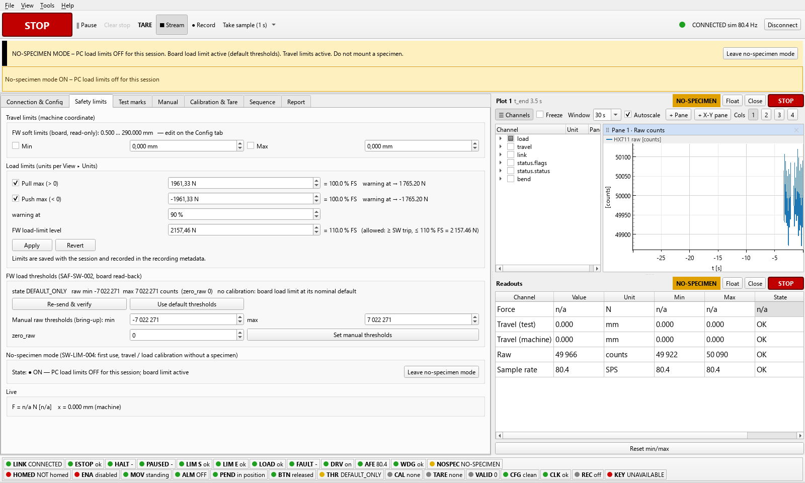
4. Leave it with **Leave no-specimen mode** (banner or Safety limits tab) as soon as calibration and tare exist. It
   also ends at disconnect, link loss and exit (message `No-specimen mode ended … – PC load limits active again`).

Sequences with load steps are refused in this mode; travel-only sequences ask for a confirmation.

---

## 6. Driver enable and homing
On the **Manual** tab, box **Axis**:
1. Tick **Driver enabled**. The ENA chip shows `ENABLING … ms` while the driver settles (≈ 0.5 s), then `enabled`.
   Unticking asks `Specimen unloaded? …`: disabling removes the holding torque, the axis becomes NOT homed.
2. Press **HOME**. The axis drives to the **START** limit switch, backs off and sets machine zero. With a load
   ≥ 5 % FS or with an unknown load (no calibration / tare) the application asks first
   (**I accept homing under load** + **Home**). Make sure the path towards START is free.

   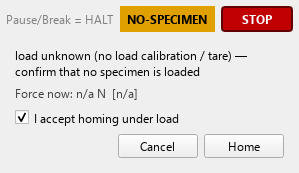
3. When done: **HOMED** chip green `homed`, the Axis box shows `● HOMED`.

Homing is needed after: power-up or board reset, the red E-stop, disabling the driver, idle auto-disable, a homing
failure, **Save & reboot**. Re-homing reports the drift of the home switch; a drift above the tolerance latches
`HOME_DRIFT` (check the switch, **Clear faults**). `homed ±1 step` (HOMED amber) means the position may be one step
off: re-home before a sequence (the start is refused).

Before homing, the axis can only be jogged slowly (≤ 2 mm/s) and within a limited window around the position where
it became un-homed.

---

## 7. Manual control

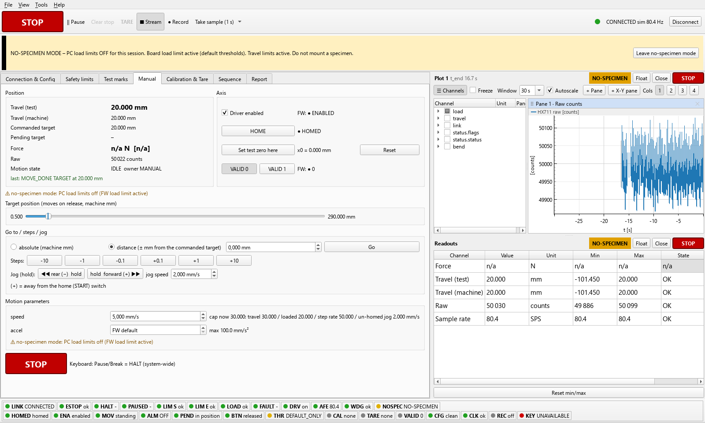

**Position** box: travel (test) and (machine) in mm, **Commanded target**, **Pending target**, force, raw counts,
motion state and the last move result (e.g. `last: MOVE_DONE TARGET at 20.000 mm`).

Moving the axis (all buttons are disabled when the gates refuse — the tooltip says why; a line under the Position
box lists the reasons, e.g. `Motion refused: driver not enabled; axis not homed; …`):
- **Target position** slider (machine mm, range = your SW travel limits): drag the handle; the axis moves **only when
  you release it** — exactly one move. Clicks on the groove, the mouse wheel and the keyboard never move the axis.
- **Go to**: choose **absolute (machine mm)** or **distance (± mm from the commanded target)**, enter the value,
  press **Go**.
- **Steps**: **-10**, **-1**, **-0.1**, **+0.1**, **+1**, **+10** mm from the commanded target. Clicks while moving
  accumulate: the newest target wins and is sent when the current move ends ("Pending target").
- **Jog (hold)**: **◀◀ rear (−) hold** / **hold forward (+) ▶▶** move while the mouse button is held, at **jog
  speed**. Releasing the button, switching windows or tabs stops the jog; the board also stops on its own when the
  PC stops refreshing (dead-man). (+) = away from the home (START) switch = pull direction.
- **Motion parameters**: **speed** and **accel** for moves; the helper text shows the caps (travel 30 mm/s, under
  load 20 mm/s, un-homed jog 2 mm/s). A red field is not applied; an amber warning means the speed is high for the
  load-limit margin.

Other Axis controls:
- **Set test zero here**: test travel 0 := the commanded position (e.g. at specimen contact); **Reset** returns to
  machine zero. Sequences use the test coordinate by default. The test zero is a PC value only.
- **VALID 0** / **VALID 1**: the manual data-validity marker (stored with every data row; used by the report). Refused
  while a sequence runs; every stop clears it.

PAUSED in manual mode: the line `PAUSED … – motion blocked` with **Resume** appears. Resume only clears the pause; it
never moves the axis.

The big **STOP** at the bottom of the tab is the same as the toolbar STOP.

---

## 8. Travel calibration
Measures the real steps/mm of the axis (nominal 800 steps/mm). Needed once after installation and after mechanical
work. Requires: connected, driver enabled, homed, no latch, **no specimen**, room for 62 mm in + direction. Allowed in
no-specimen mode. You need a caliper or dial gauge.

1. **Calibration & Tare** tab → **Start travel calibration wizard…**. The start page lists what is missing and the
   expected value. A missing load calibration asks you to confirm that no specimen is mounted.

   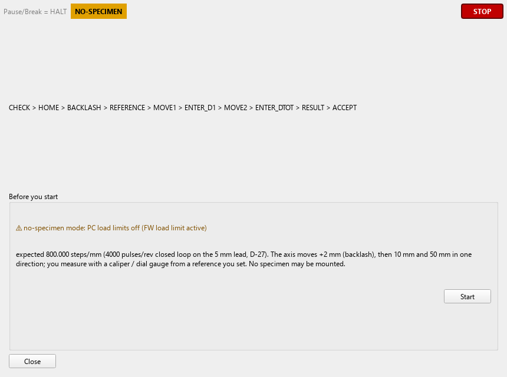
2. **Start** → **Move +2 mm ▶** (backlash take-up).
3. Zero the caliper / dial gauge at the current position (or mark the carriage) → **Move 10 mm ▶**.
4. Measure the distance from your reference, enter **Measured distance D1** → **Set trial steps/mm ▶**. The trial
   value is written to the board RAM and read back. Large changes ask for a confirmation (e.g. 160 steps/mm would
   mean the driver DIP switches were not changed).

   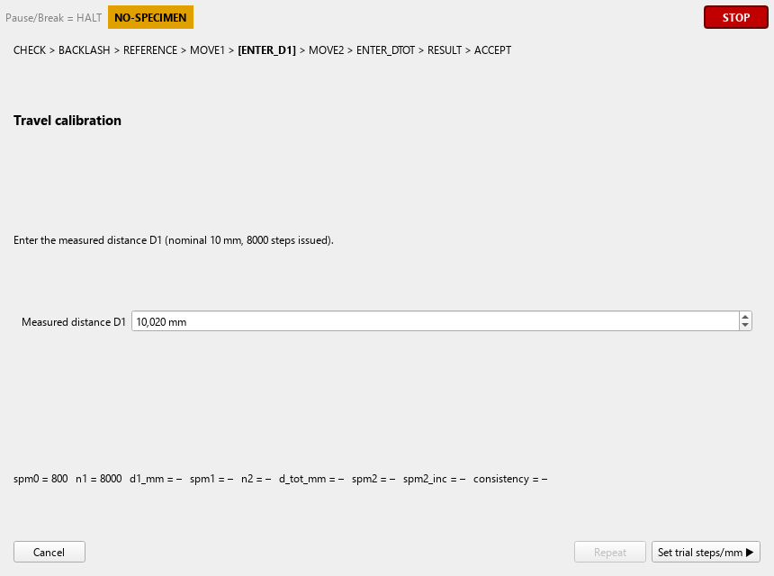
5. **Move 50 mm ▶** (do not touch the caliper), then enter the **total** distance from the reference
   (nominal 60 mm) → **Compute ▶**.
6. Check the result (`spm0 → spm1 → spm2`, consistency) → **Accept ▶**: the value is written, saved to the board NVM
   and to the calibration file.

   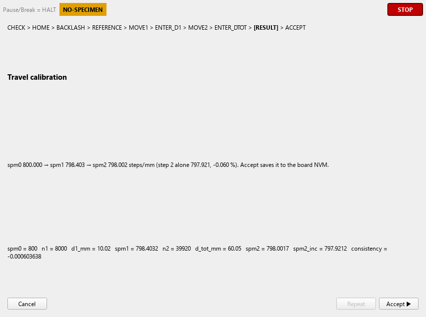

**Cancel**, STOP, PAUSE or any latch abort the wizard; the previous steps/mm is restored automatically
(`steps/mm restored to …`). If that is impossible (e.g. link lost) the notice strip and the **TCAL** chip show
`Board steps/mm … differs from …` with **Restore**, **Keep board value** and **Ignore for this session**.
Buttons with ▶ move the axis and react to the mouse only. Re-home after the calibration.

---

## 9. Load calibration with 1 kg + 10 kg
Fits force = K·(raw − offset) from a zero point and two hanging weights. Needed after installation, after changing the
cell, cable or HX711 settings (gain / rate), and when the calibration is older than your lab rule. Allowed in
no-specimen mode. Tension (pull) calibration only; push forces are reported as "tension-calibrated".

1. **Calibration & Tare** → **Start load calibration wizard…**. Set **pre-settle** and **capture** (default 2 s /
   10 s). The page states: `Weights 1 kg + 10 kg (D-22) cover only 5 % FS → the calibration carries LOW_SPAN …`.
   **Start**.

   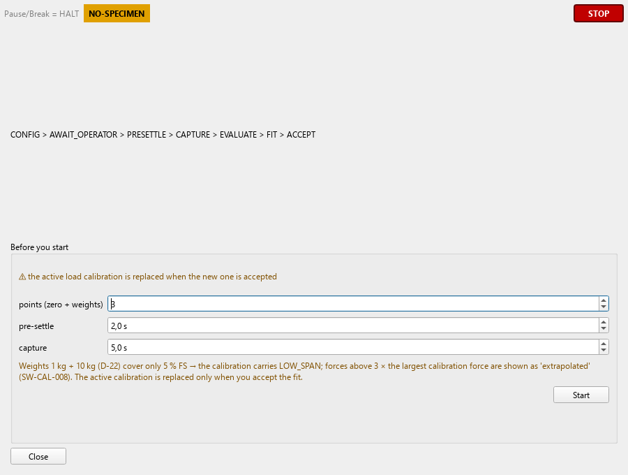
2. Zero point: remove everything from the cell (no specimen, no weights, empty hook) → **Capture zero point ▶**. Do
   not touch the stand during pre-settle and capture.

   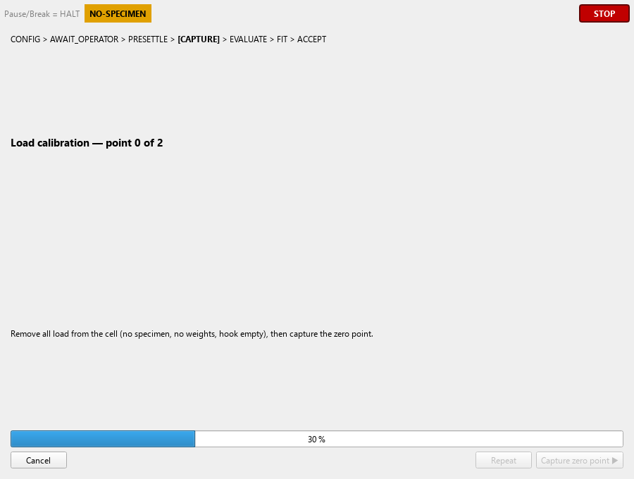
3. Point 1: hang the **1 kg** weight, wait until it hangs still, check **Mass** (1.000 kg) → **Capture point 1 ▶**.

   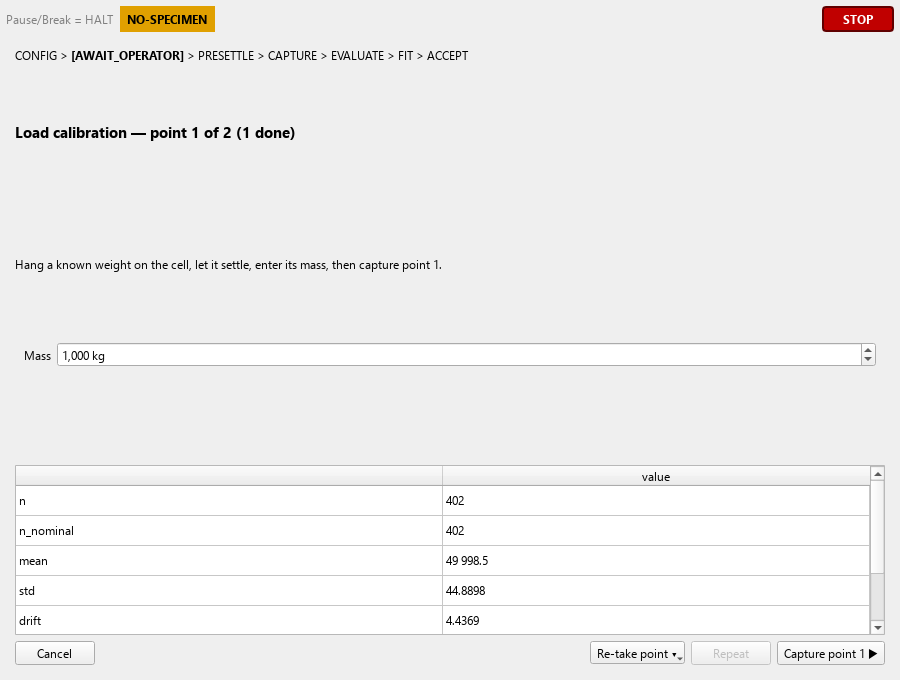
4. Point 2: hang the **10 kg** weight → **Capture point 2 ▶**. A rejected point (swinging weight, drift, outliers)
   shows the reason; **Repeat** it.
5. Fit page: points, residuals, K, status **PASS / WARN / FAIL**. WARN needs a confirmation; FAIL cannot be accepted
   (**Re-take point ▾**). **Accept calibration ▶** makes it the active calibration; the previous file is kept.

   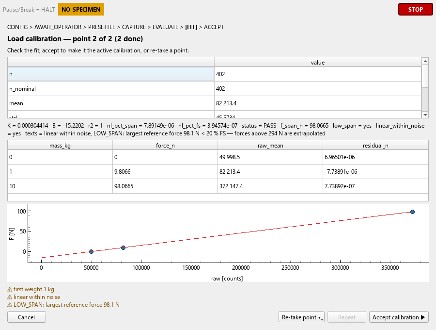
6. Remove the weights and **tare** (§10).

**Plausibility checks.**
- **Weight not detected**: after a weight point the wizard stays on that point and shows in red
  `weight not detected: raw change … counts from the zero point < … counts … — hang the weight and re-take the point`
  ("from the previous point" when the previous weight is the problem). The signal did not change enough: the weight is
  not hanging on the cell, touches something, or the mass is wrong. Hang the weight properly and press **Repeat**, or
  correct **Mass** and press the capture button again. The check is repeated after the last point and after
  **Finish with 2 points**.
- **K implausible**: on the fit page a confirmation opens, `K implausible: |K| = … N/count is … × the nominal …
  (expected 0.5…2 ×) — check the weights, the cell and the AFE gain. Accept anyway?`. The calibration factor is far
  from the value expected for the configured load cell and HX711 gain: usually a wrong mass, a wrong weight, the wrong
  cell or a changed gain. Close the question, check them and **Re-take point ▾**. Accept only if you are sure (tick
  **I checked the weights, the cell and the AFE gain**, then **Accept calibration**); pressing **Accept calibration ▶**
  again re-opens the question.
- `nominal unknown: K plausibility not checked` (shown with "(i)") is information only: the nominal value of the
  configured cell is not known, so this check was skipped.

**What LOW_SPAN means.** 1 kg + 10 kg = 98 N, only 5 % of the 1961 N full scale. The fit is accurate inside that
range; above it the linearity is assumed, not measured. The calibration therefore carries the warning `LOW_SPAN`
(CAL chip amber `PASS LOW_SPAN`, report warning), and forces above **3 × the largest weight (≈ 294 N)** are marked
**extrapolated** (readout state `EXTRAPOLATED`, dashed curves). This is accepted for release 1 (D-35 G2); a heavier
reference weight removes it. Warnings such as `first weight 1 kg` and `linear within noise` are informational.

The **Calibration & Tare** tab shows the active calibrations, their files and **History…**:

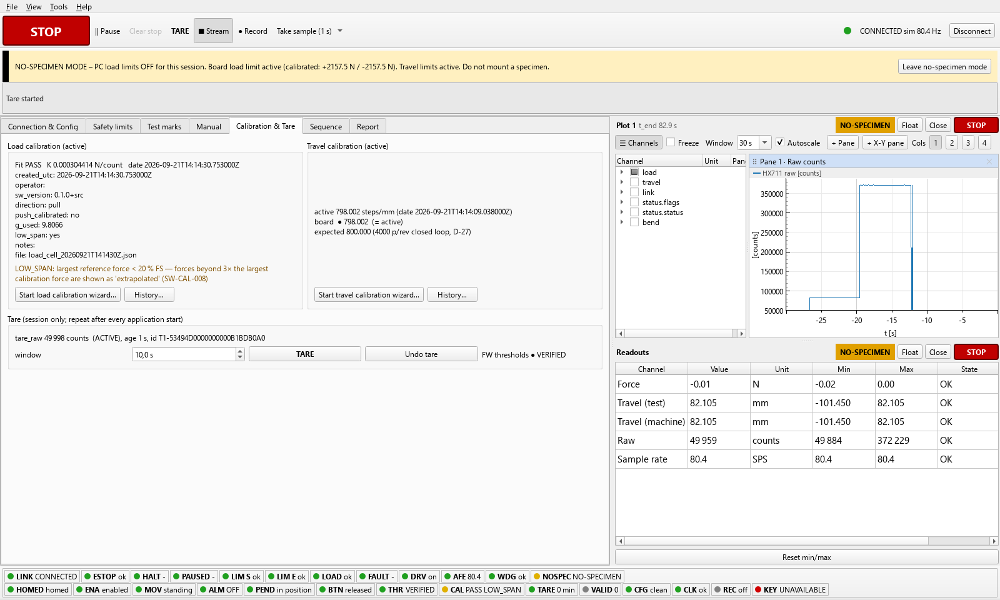

---

## 10. Tare
Tare sets the zero force of the mounted fixture (robust mean of the raw signal over a window). **Tare is valid for
this session only** — repeat it after every application start, after changing the fixture and **before every test**.

1. Unload the cell (fixture mounted, specimen not yet loaded), axis standing still for ≥ 1 s.
2. Press **TARE** (toolbar — from any tab — or the **TARE** button on the Calibration & Tare tab, where you can also set
   the **window**, default 10 s).
3. The **Tare** window shows the progress and statistics. Keep the stand still.

   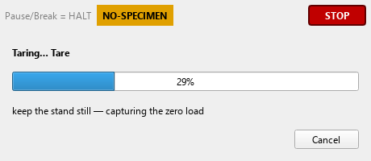  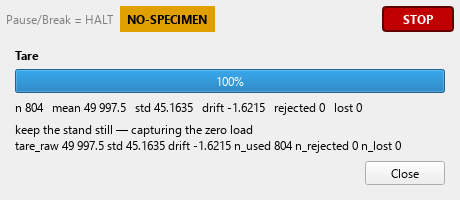
4. Result: **TARE** chip green with its age (amber after 30 min), the board thresholds are re-sent and verified
   (**THR** `VERIFIED`).

Refusals are shown verbatim, e.g. `axis moving`, `less than 1 s after a move — wait`, `sequence capture window open`,
`HX711 stale`. A large offset (> 10 % FS from the calibration zero: specimen loaded?) gives a warning with
**Undo tare**. **Undo tare** on the Calibration & Tare tab restores the previous tare.

---

## 11. Safety limits

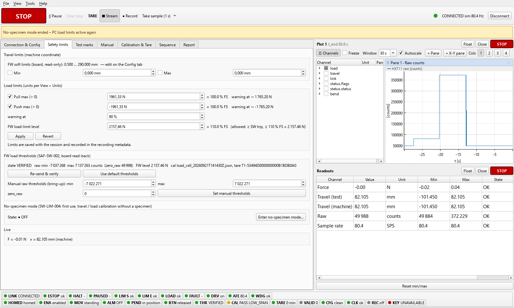

- **Travel limits (machine coordinate)**: **Min** / **Max** (tick to enable) inside the board soft limits
  (0.5 … 290 mm by default). The slider range and the sequence checks follow them. A SW travel limit also bounds the
  approach of load-target steps.
- **Load limits** (unit per **View ▸ Units**): **Pull max (> 0)**, **Push max (< 0)**, **warning at** (% of the limit,
  default 90 %), **FW load-limit level** (board limit, ≤ 110 % FS, ≥ the SW limit). **Apply** / **Revert**. Set them
  for every specimen: a little above the expected maximum force.
- A PC limit trip sends STOP, terminates the sequence and shows `SW limit trip: …`; move back / unload — the latch
  clears inside the limit.
- **FW load thresholds**: the PC converts the board limit to raw thresholds (with the calibration and tare) and reads
  them back: state `VERIFIED` (THR chip green). `FAILED` / `INVALID` disables motion: **Re-send & verify**. **Use
  default thresholds** / **Set manual thresholds** are bring-up tools for the maintainer only.
- **No-specimen mode** (§5).
- Both PC load limits can be switched off only in the no-specimen mode: **Apply** refuses it with
  `both PC load limits cannot be switched off — use the no-specimen mode` and highlights
  **Enter no-specimen mode…**. Switching one limit off also needs a valid load calibration and tare.
- Limits are saved with the session (**File ▸ Save session as…**) and written into every recording. A session file
  with both load limits off is loaded with both switched on again (message `Session …: …`, issue
  `LOAD_LIMITS_RESTORED`); a broken session file is ignored, defaults are used and the file is kept as `<name>.bad`.

---

## 12. Test marks
Marks identify the test in the recording folder name, the metadata and the report.

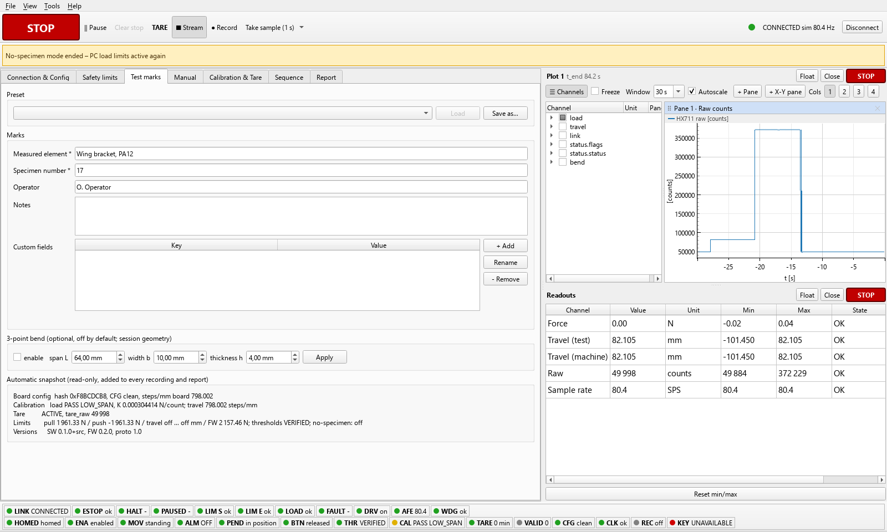

- **Measured element \***, **Specimen number \*** (recommended: a recording without them starts with a warning),
  **Operator**, **Notes**, **Custom fields** (**+ Add**, **Rename**, **- Remove**; keys must be unique).
- **Preset** (**Load**, **Save as…**, `*.bbmarks.json`) for repeated specimen types.
- **3-point bend** (optional, off by default): tick **enable**, enter **span L**, **width b**, **thickness h**,
  **Apply**. Enables the derived channels σ [MPa] and ε and the 3-point-bend part of the report (§16).
- **Automatic snapshot** (read-only): configuration, calibration, tare, limits and versions added to every recording.
- Edits during a recording are logged; the final marks are written when the recording stops.

---

## 13. Realtime plots, readouts and event log

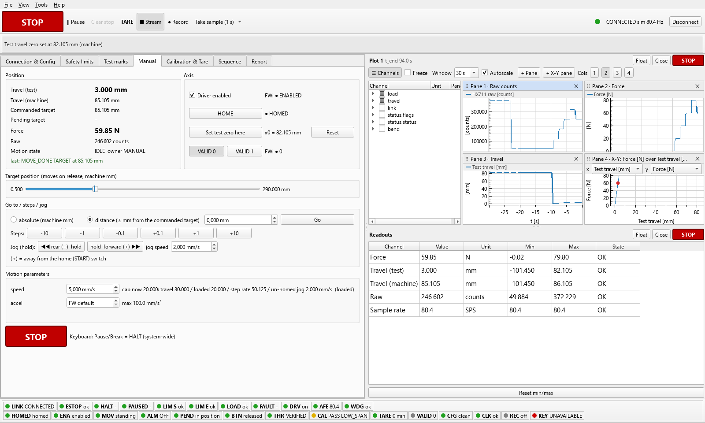

**Plot windows.** Plot 1 exists at start; **View ▸ New plot window** adds more (up to 4, tabbed with Plot 1).
Each window can **Float** (e.g. onto a second monitor), **Close** (re-open from the View menu) and has its own
**STOP**. Window toolbar:

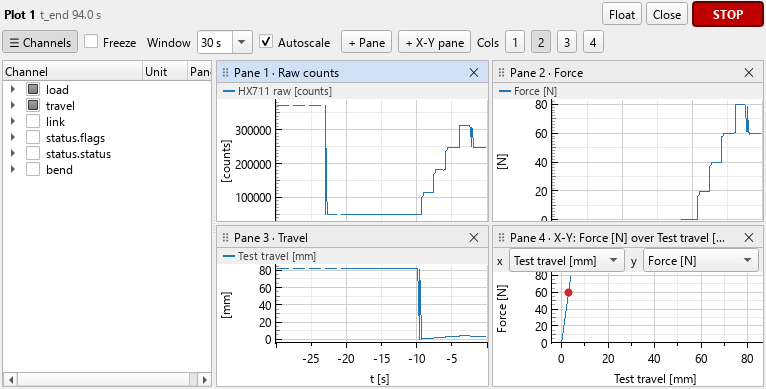

| Control | Function |
|---|---|
| **☰ Channels** | show / hide the channel tree (groups load, travel, link, status bits, bend). Greyed channels need a prerequisite (tooltip, e.g. calibration + tare) |
| **Freeze** | stops updating this window; zoom / pan with the mouse; the recording continues |
| **Window** | time span 5 … 600 s (default 30 s) |
| **Autoscale** | Y follows the data; off = manual Y (mouse zoom / pan) |
| **+ Pane** / **+ X-Y pane** | add a time pane / a travel–force (X-Y) pane |
| **Cols** **1** **2** **3** **4** | number of pane columns |

- Tick a channel: it joins the first pane that shows the same quantity, else an empty pane. Right-click a channel for
  **Plot in pane** / **Move to pane** / **Remove from plot**.
- Panes: drag a pane by its title to reorder it or to move it into another plot window; double-click the title to
  rename; right-click the title for **Rename…**, **Move curve**, **Move to window…**, **Show legend**, **Close pane**.
  A pane holds up to two units (left and right axis).
- Status bits are drawn as 0/1 lanes. Extrapolated forces are dashed, invalid data grey.
- The layout (windows, panes, curves) is saved on exit and restored at start; **View ▸ Save layout now** saves it at
  once.

**Readouts** (dock): **Force**, **Travel (test)**, **Travel (machine)**, **Raw**, **Sample rate** with Value, Min,
Max and **State** (`OK`, `EXTRAPOLATED`, `STALE`, `SATURATED`, `INVALID`, `n/a`). **Reset min/max**.

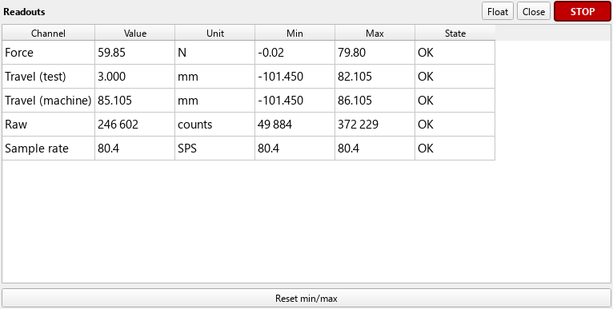

**Units**: **View ▸ Units ▸ N / kgf** switches force display everywhere (stored in the session).

**Event log** (**View ▸ Event log**): every stop with its cause, latch set / clear, move results, refusals, tare and
calibration results, file names. Use it to find out why something stopped.

---

## 14. Recording and Take sample
- **● Record** starts a recording; press again to stop. It is disabled while the board is not connected
  (`not connected — connect to the board first …`); a running recording can always be stopped, also after a link
  loss. A sequence starts its own recording automatically (then the button refuses
  `recording belongs to the running sequence`). Missing marks give a warning, not a refusal.
- Folder: `<recordings>\<YYYYMMDD_HHMMSS>_<element>_<number>\` with `data.csv` (one row per board sample, every
  derived column, event rows), `meta.json` (marks, snapshot, integrity) and after a sequence `report.json` /
  `report.html`. Default recordings folder: `Documents\BirdBendStand\recordings`.
- **REC** chip: red dot with the row count while recording, amber when the write queue is ≥ 50 % full, red `FAILED`
  on a write error (§17).
- **Take sample** averages the force, travel and raw signal over the chosen window (**0.1 s … 10 s**, default 1 s) and
  shows `Sample taken: F̄ = … N, σ … N, N …; x̄ = … mm …`. Rows go to `samples.csv` in the recording folder, or to
  `<recordings>\samples\samples_<YYYYMMDD>.csv` when not recording.

---

## 15. Sequences
A sequence is a list of steps executed automatically with capture windows for the report.

### 15.1 Editor

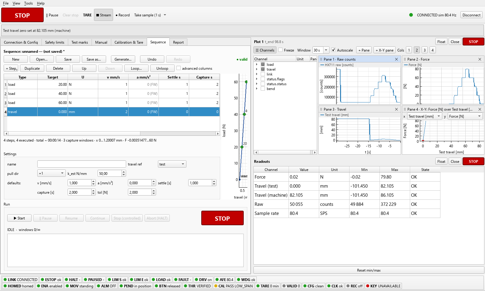

- Files: **New**, **Open…**, **Save**, **Save as…** (`*.bbseq.json`); `*` in the title = unsaved. **Undo** / **Redo**.
- **+ Step** ▾ adds a step after the selection: **travel** (target mm), **load** (target N), **hold** (wait /
  capture in place), **home**, **tare**, **mark** (label; optional **Wait op.** = wait for **Continue**).
  **Duplicate**, **Delete**, **Up**, **Down**.
- **Loop…** wraps the selected steps (count, 0 = until stopped); **Unloop** removes it. The loop is drawn in the row
  header.
- Columns: **Type**, **Target**, **U**, **v mm/s** (empty = default), **a mm/s²** (0 = board default), **Settle s**,
  **Capture s**, **Time s** (minimum step time, travel / hold), **Tol** (load tolerance, N), **Label**, **!**
  (issues). **advanced columns**: **Capture in move**, **Wait op.** Cells that do not apply show "–".
- Every edit is checked: red cell = error (start refused), amber = warning; the tooltip explains. `● valid` when
  there is no error.
- **Settings**: **name**, **travel ref** (**test** = relative to the test zero, frozen at the start; or machine),
  **pull dir**, **k_est N/mm** (expected stiffness for the plan; updated from the run), step **defaults**.
  The sequence's **pull dir** must match the machine setting of the session; otherwise **▶ Start** is refused with
  `PULL_DIR_MISMATCH` (both values named) and the **pull dir** field turns red.
- The **chart** on the right shows the planned path (x = travel, y = load) with capture points (green); during a run
  a live marker and the measured trace.

Timeline of every step: command → target reached → **Settle** → **Capture** (VALID = 1, statistics for the report) →
hold until **Time** has passed. Settle and capture are counted from "target reached".

### 15.2 Generators
**Generate…** opens the generator wizard: **Staircase** (travel or load levels, up / up-and-down, optional return to
zero), **Linear ramp**, **Cyclic / triangle**, **Hold / creep–relaxation**, **Return** (to test zero or home).
Choose, set the parameters, **Continue** to the preview (steps, duration, path), then **Insert** (append, insert after
the selected row, or replace all). The inserted steps stay editable.

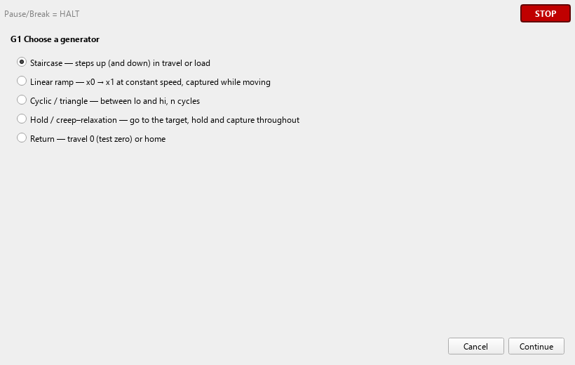
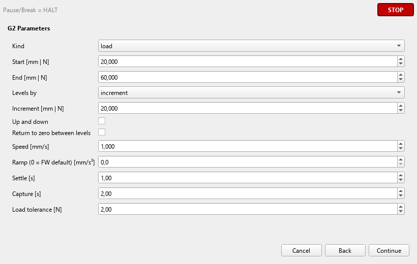
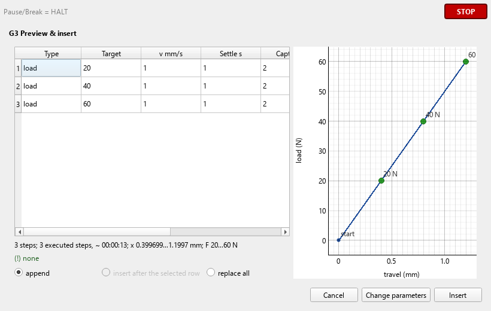

### 15.3 Load-target steps
A **load** step drives towards the target force and then trims it:
1. **Approach**: the axis moves in the pull / push direction at the step speed until the force reaches the target
   band, at most up to the **approach bound** = the nearer of the board soft limit and an enabled SW travel limit in
   that direction.
2. **Trim**: up to 10 small moves until the force is within **Tol** of the target.
3. Settle and capture as for travel steps.

**NOT_REACHED**: the bound was reached without the target force (or the trim could not converge). The axis stops
there — this is **not** a limit trip — the step result is red
`… load target not reached at the approach bound (axis stopped there; not a limit trip)`, the chart shows a red cross,
and the sequence ends STOPPED. Set the SW travel limit as the bound you accept for the specimen.

Load steps need a valid calibration and tare, PC load limits on (not in no-specimen mode) and **THR** `VERIFIED`.

### 15.4 Guards
While a sequence moves or holds, the PC watches the force:

| Flag | Meaning | Reaction |
|---|---|---|
| **BREAK_DETECTED** | the force drops by more than 20 % of its running maximum while loading; at standstill (settle, capture, hold) a drop of more than 20 % within 0.5 s | STOP, sequence STOPPED |
| **SLIP** | the force moves opposite to the motion by more than 5 % (grip slipping) | STOP, sequence STOPPED |
| **TIMEOUT** | the step takes longer than planned (1.2 × travel time + 10 s) | STOP, sequence STOPPED |
| **DRIVER_ALARM** | the driver ALM output became active | controlled STOP, sequence STOPPED |
| recording failure | the recording could not be written | controlled STOP |

Guards arm once the force exceeds max(5 % of the step target, 1 % FS). Other step flags: **ON_TARGET**,
**NOT_ON_TARGET** (capture mean outside Tol), **INCOMPLETE** (capture window shorter than planned),
**WINDOW_DISCARDED** (window interrupted, e.g. by Pause).

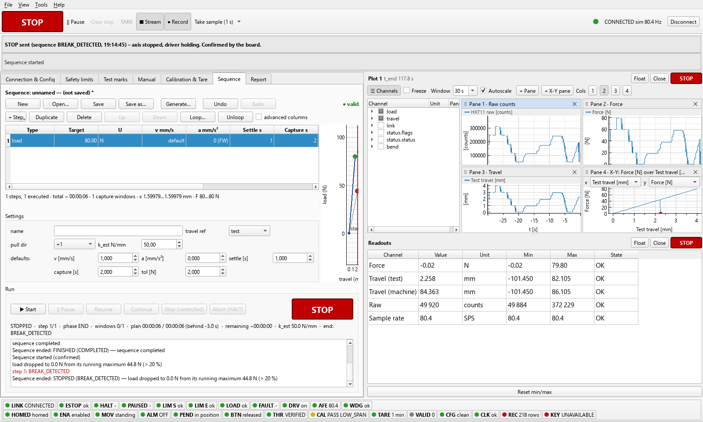

### 15.5 Run
Run box: **▶ Start**, **‖ Pause**, **Resume**, **Continue**, **Stop (controlled)**, **Abort (HALT)** and a big
**STOP**. Start, Resume and Continue react to the mouse only (they start motion).

1. **▶ Start** checks everything. Refusals are listed one per line, e.g. not homed, driver not enabled, PAUSED,
   `POS_UNCERTAIN` (re-home), `AFE_RATE_MISMATCH`, driver alarm, a latch, editor errors, targets outside the SW limits,
   load steps without calibration / tare or in no-specimen mode. Items that need your agreement (Pause/Break key not
   available, HOME steps under load, travel calibration differs, `LOW_SPAN`) open a confirmation:

   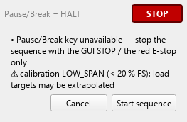
2. While running: the active row is highlighted, the run line shows state, step, phase (APPROACH, TRIM, SETTLE,
   CAPTURE, HOLD …), capture windows, plan time, remaining time and k_est; messages and step results are listed below.
   The editor is read-only.

   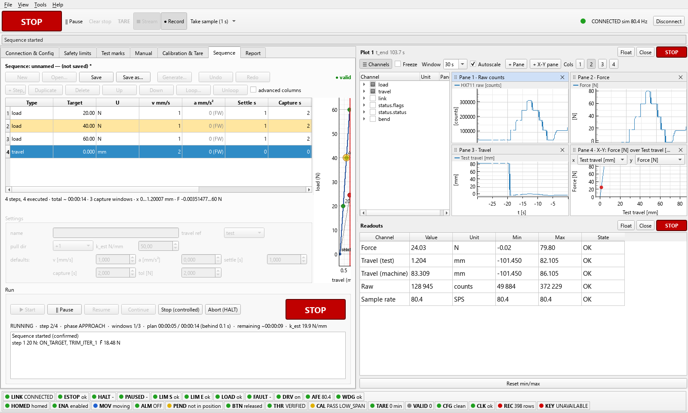
3. **Pause** (toolbar, Sequence tab or the PAUSE button): controlled stop, state PAUSED, open capture window discarded.
   **Resume** re-runs the interrupted step from its absolute target (approach + trim + capture anew). A second press
   of the physical PAUSE button also resumes. To end a paused sequence use **Stop (controlled)** (or Clear stop, which
   asks first).

   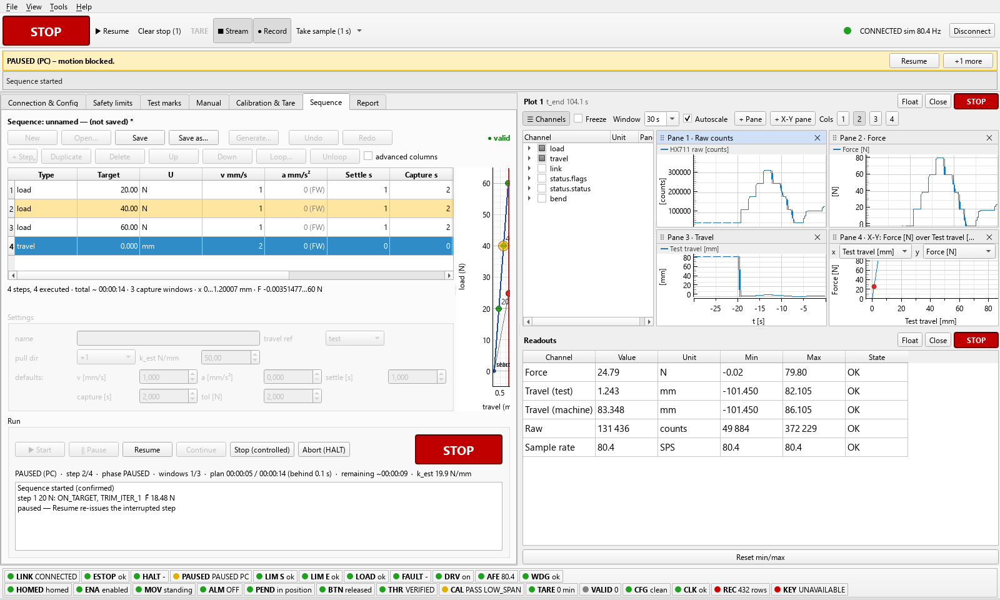
4. The sequence ends `FINISHED`, `STOPPED` (with a reason, e.g. NOT_REACHED, BREAK_DETECTED) or `ABORTED` (STOP,
   HALT, E-stop, latch, link loss). The report is built automatically (§16).

   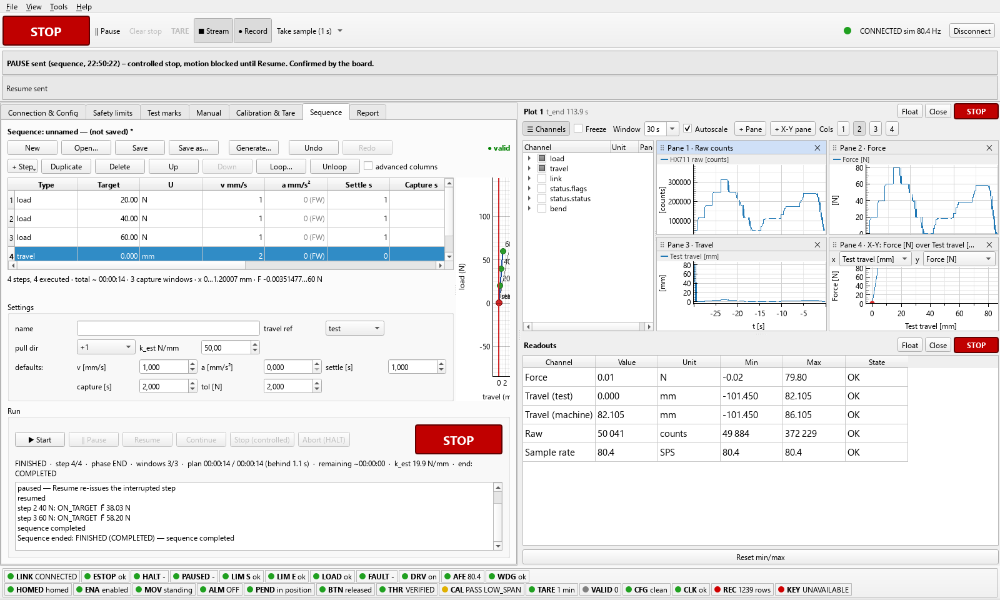

---

## 16. Reports
At the end of every sequence (also stopped or aborted ones, marked partial) the application builds the report from
the recording: `report.json` and a self-contained `report.html` next to `data.csv`. Contents: marks, configuration /
calibration / tare / limits snapshot, warnings (LOW_SPAN, push forces tension-calibrated, no-specimen mode, incomplete
windows, NOT_REACHED, guard stops, frame losses, extrapolated forces), force–travel and force–time figures, the step
result table per step and loop iteration (F mean / std / min / max, x mean, flags) and the sequence events.

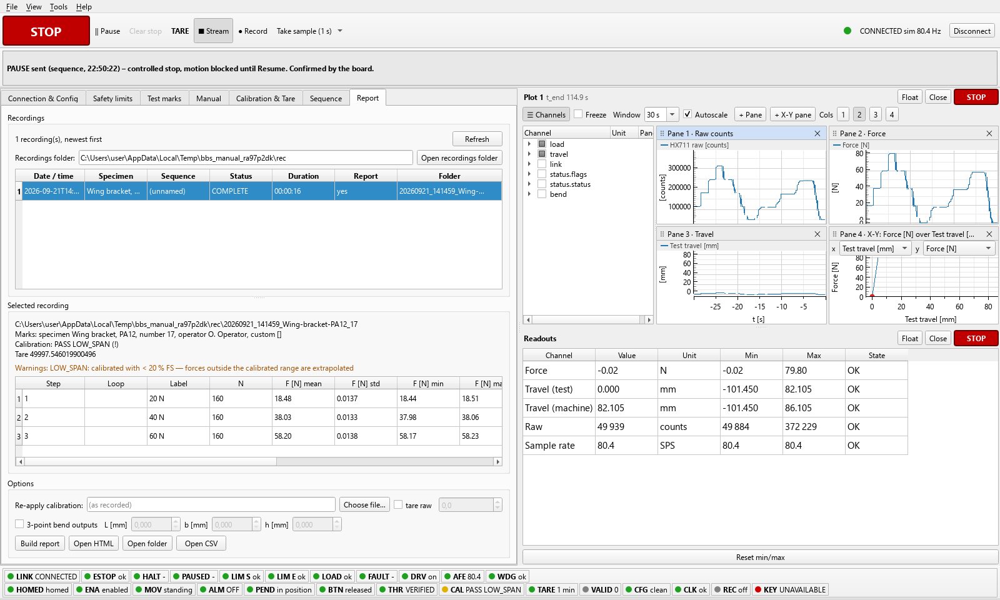

**Report** tab:
- **Recordings folder**: where recordings and reports are written (read-only here) and **Open recordings folder**
  (opens it in the Windows file browser; before the first recording the folder does not exist yet).
- **Recordings** list (newest first; **Refresh**): date / time, specimen, sequence, status (`PARTIAL` / `FAILED` in
  red), duration, report yes / no, folder.
- **Selected recording**: marks, calibration, tare, warnings and the step results.
- **Options**: **Re-apply calibration** (**Choose file…**; empty = as recorded), **tare raw** (another tare value),
  **3-point bend outputs** (**L [mm]**, **b [mm]**, **h [mm]**; pre-filled from the Test marks geometry).
- **Build report** (re)builds the report with these options, **Open HTML**, **Open folder**, **Open CSV**.

Rebuilding never changes `data.csv`; the same code builds the report live and offline, so a rebuilt report with the
same options reproduces the numbers.

**Offline rebuild** without the GUI (no board needed). In the installed application, from a command prompt in the
program folder:
```
BirdBendStand-cli.exe report <recording folder> [--cal load_cal.json] [--tare-raw 49997] [--bend3p L b h]
                             [--out <folder>]
```
It writes `report.json` and `report.html` into the recording folder (or into `--out`) and prints both paths; exit
code 0 = done, 2 = the folder is not a readable recording. In a development checkout the same command is
`..\.venv\Scripts\python -m bend_stand report …` (from `03_SW\src`). The Report tab (**Build report**) does the same
from the GUI.

**3-point bend** (optional, SW-REP-004): with span L, width b and thickness h the report adds per capture window the
flexural stress σ = 3FL/(2bh²) [MPa] and strain ε = 6δh/L² (δ = test travel), and the flexural modulus
E_f = L³·m/(4bh³) [MPa] from the slope m [N/mm] of the window means. Set the test zero at specimen contact so that
travel = deflection.

---

## 17. Troubleshooting

| Symptom | Meaning | What to do |
|---|---|---|
| Banner `LINK LOST – reconnecting…` / `LINK LOST – STOP sent; sequence terminated. Reconnecting…`, LINK chip red, **WDG** red | USB / VCP link interrupted; the board stops a running move by itself after 1 s (controlled, holding) | Check the USB cable and that the PC does not sleep / suspend USB. **Tools ▸ Link statistics…** shows CRC errors and timeouts. After reconnecting: check HOMED, TARE, THR; no-specimen mode has ended. |
| **AFE** red `AFE_STALE` / `NO_AFE_DATA`, readouts `STALE` | no HX711 samples (wiring, supply, module) | Stop; check the HX711 module, its 3.3 V supply and DOUT / SCK wires and the cell cable. **Clear faults** after fresh samples. |
| **AFE** red `AFE_SATURATED` | HX711 at its rail: overload, wrong gain or a broken cell wire | Unload; check the cell and the bridge wiring. |
| **AFE** amber `AFE_RATE_MISMATCH` | the measured sample rate differs from `afe.rate_sps` (80 Hz expected) by more than 20 % | Sequences are refused. Check the RATE wire of the HX711 module (PB5) and `afe.rate_sps` on the Config tab. |
| **AFE** amber `AFE_SETTLING` | HX711 settling after a configuration change | Wait a moment. |
| **ALM** red `ALM – new motion blocked` | driver alarm (over-current, following error, supply); a running move continues, new motion is refused, a sequence stops (`DRIVER_ALARM`) | Recommended reset (OI-UM-02): 1. press the red **E-stop** (the axis becomes NOT homed, the load may spring back); 2. switch the 48 V driver supply **off**, wait until the driver LEDs are dark, find the cause (overload, jam, wiring); 3. supply **on**; 4. release the E-stop, **Clear stop… → Clear E-STOP**; 5. **Driver enabled**, **HOME**. |
| **LIM S** / **LIM E** red | limit switch reached | Move away from the switch (only that direction is accepted); the latch clears when released. |
| both **LIM** chips red, `LIMIT_WIRING` | both limit inputs active at once. The switches are normally-closed: an unplugged connector or broken wire reads as "active" | Do not move. Check the START / END switch connectors and cables. **Clear faults** once the inputs are no longer both active. |
| Load wizard: `weight not detected: …` | the raw signal did not change enough between two points | Hang the weight freely (nothing touching), check the mass, **Repeat** the point (§9). |
| Load wizard: `K implausible: …` | the fitted K is outside 0.5…2 × the nominal value of the configured cell / AFE | Check the weights, the masses entered, the load cell and the HX711 gain (`afe.gain_channel`); re-take the points. Accept only after checking (§9). |
| Window **Different board connected** (UID …) after a reconnect | another Nucleo board answered than before: its position reference and settings belong to another stand | The test travel zero was reset. Check the SW travel limits, the travel and load calibration and tare before the next test; **Acknowledge**. |
| Banner `Motion refused: board parameters outside the dictionary range: … — read / write the configuration` (`PARAM_INVALID`) | the board holds parameter values the PC does not accept | **Connection tab** → **Read all**, correct the named parameters (or **Restore defaults…**), **Write & verify**, **Save to NVM**. |
| `start refused [PULL_DIR_MISMATCH]: sequence pull direction … differs from the session pull direction …` | the sequence was written for the other pull direction | Set **pull dir** in the sequence settings to the session value (or open the right session), save the sequence. |
| Safety limits: `both PC load limits cannot be switched off — use the no-specimen mode` | both PC load limits off is allowed only in the no-specimen mode | Keep at least one limit on, or use **Enter no-specimen mode…** (no specimen mounted!). |
| Message `Session …: both PC load limits were off …` (`LOAD_LIMITS_RESTORED`) / `session file ignored …; the file was kept as ….bad` | the session file was corrected / could not be read | Check the Safety limits tab; re-save the session. A `.bad` file can be inspected or deleted. |
| Configuration buttons refused while a sequence or wizard runs | the board configuration cannot change during a test | Wait until the sequence / wizard has ended (or stop it). |
| Report tab: no report for a run, `closed_during_sequence` in `meta.json` | the application was closed during a sequence (the run is ABORTED "shutdown") | **Build report** on the Report tab rebuilds it from the recording. |
| `HOME_NOT_FOUND` / `HOME_WIRING` | homing did not find the START switch / saw the END switch | Check the START switch and its wiring, then **Clear faults** and **HOME** again. |
| `HOME_DRIFT` | the home switch moved more than the tolerance since the last homing | Check the switch mounting; data since the previous homing may be offset. **Clear faults**. |
| `LOAD_LIMIT` | board load limit or ADC saturation | **Clear faults**, then move to reduce the load. Check the limit levels (§11). |
| `SW limit trip: …` | a PC load / travel limit was exceeded | Move back / unload; check the limits. |
| `RECORDING FAILED: … – sequence stopped (controlled).`, **REC** red `FAILED` | write error, disk full or too little free space (at least 500 MB are required) | Free disk space or choose another drive; the data written so far stays in `data.csv` (`meta.json` says `complete: false`). Start a new recording. |
| **REC** amber | write queue ≥ 50 % (slow disk) | Close other programs writing to the disk. |
| **KEY** red `UNAVAILABLE` / amber `LL_HOOK` | Pause/Break key not registered system-wide / fallback hook | Red: the key works only while the application is in front. Restart the application; run **Tools ▸ Test Pause/Break key…**. |
| **KEY** red `NOT RESPONDING`, message `Pause/Break key not responding …` | the hotkey thread stopped answering (> 0.75 s) | Use the on-screen **STOP** or the red E-stop; the key works only while the window is focused. Finish or stop the test, then restart the application. |
| `STOP NOT SENT …` / `… NOT CONFIRMED …` | the PC could not send or confirm the stop | **Press the red E-stop.** Then check the link. |
| **HOMED** red `NOT homed` after an E-stop / reset / idle | position lost or reference cleared | **Driver enabled**, **HOME**. |
| **HOMED** amber `homed ±1 step` (`POS_UNCERTAIN`) | position may be one step off | Re-home before a sequence. |
| **ENA** red `disabled` without your action | idle auto-disable (600 s, load < 2 % FS) or E-stop | **Driver enabled**, **HOME**. |
| **THR** amber / red | board thresholds not verified (`DEFAULT_ONLY`, `FAILED`, `INVALID`) | Safety limits tab → **Re-send & verify**; tare again; recalibrate if `INVALID`. |
| **CAL** amber `(invalid for limits)` | the HX711 configuration differs from the calibration | Restore the calibrated gain / rate or recalibrate. |
| **TCAL** amber / notice `Board steps/mm … differs …` | board steps/mm ≠ active travel calibration (e.g. after an aborted wizard) | **Restore** (normal), **Keep board value** or **Ignore for this session**. |
| **CFG** amber `dirty` / `NVM defaulted` / `reboot pending`; **RO** red | configuration state | **Save to NVM**; check and Save; **Save & reboot…**; RO: FW and PC versions must match. |
| **CLK** amber | board runs on its fallback clock (timing ±1 %) | Report to the maintainer. |
| Toolbar or tab buttons greyed | a gate refuses | Hover the button: the tooltip lists the reasons (e.g. `Clear stop first: …`). |

---

## 18. Files and folders

| What | Where |
|---|---|
| Recordings, reports, `samples.csv` | `Documents\BirdBendStand\recordings\` (default; shown on the Report tab as **Recordings folder**) |
| Calibration files (`load_*.json`, `travel_*.json`, active copies) | `%APPDATA%\BirdBendStand\calibration\` |
| Sessions, marks presets | `%APPDATA%\BirdBendStand\sessions\`, `…\presets\` |
| GUI layout and preferences | `%APPDATA%\BirdBendStand\gui.ini` |
| Logs | `%APPDATA%\BirdBendStand\logs\` |

Back up the calibration folder together with the recordings. Never edit `data.csv` or `meta.json` by hand.

---

## 19. Appendix A — indicator chips

Grey "?" = unknown (no data yet), never OK. Green = OK, amber = warning, red = alarm / latched.

| Chip | Shows | Red / amber means |
|---|---|---|
| **LINK** | PC ⇄ board link | red LOST; amber CONNECTING / DEGRADED |
| **ESTOP** | red E-stop latch `ESTOP` | red: E-stop pressed or latched |
| **HALT** | `HALT` latch (Pause/Break, Abort) and its source | red: latched |
| **PAUSED** | `PAUSED` latch and its source (PC / button) | amber: motion blocked until Resume |
| **LIM S**, **LIM E** | `LIMIT_START`, `LIMIT_END`, `LIMIT_WIRING` | red: switch active / wiring fault |
| **LOAD** | board `LOAD_LIMIT`, PC SW trip, warning level | red: trip; amber: ≥ warning level |
| **FAULT** | `STEP_FAULT`, `HOME_NOT_FOUND`, `HOME_WIRING`, `HOME_DRIFT`, `AFE_FAULT` | red: latched fault (names shown) |
| **DRV** | driver supply (optional 48 V sense; `on` while not fitted) | red: supply lost, position lost |
| **K1** | `K1_WELDED` (only with the optional contactor check; hidden while the check is off) | red: latched |
| **AFE** | HX711: rate, `AFE_STALE`, `AFE_SATURATED`, `AFE_SETTLING`, `AFE_RATE_MISMATCH`, `NO_AFE_DATA` | red: stale / saturated; amber: settling / rate mismatch |
| **WDG** | `LINK_WDG` (board link watchdog) | red: link lost while moving |
| **NOSPEC** | no-specimen mode (hidden when off) | amber: PC load limits off |
| **HOMED** | homed / `POS_UNCERTAIN` | red: NOT homed; amber: ±1 step |
| **ENA** | driver enabled | red: disabled; amber: ENABLING |
| **MOV** | standing / moving / jogging / homing | — |
| **ALM** | driver alarm output | red: new motion blocked; amber: alarm without driver supply |
| **PEND** | driver in-position output | amber: not in position |
| **BTN** | physical PAUSE button | amber: PAUSE pressed |
| **THR** | board load thresholds | red: FAILED / INVALID; amber: DEFAULT_ONLY / clamped |
| **CAL** | active load calibration | amber: WARN / LOW_SPAN / invalid for limits |
| **TCAL** | board steps/mm vs active travel calibration (hidden when equal) | amber: differs / restoring |
| **TARE** | tare age | amber: older than 30 min |
| **VALID** | data-validity flag | — |
| **CFG** | board configuration | amber: dirty / reboot pending / NVM defaulted; red: read-only |
| **CLK** | board clock | amber: fallback clock |
| **REC** | recording | red dot: recording; amber: queue ≥ 50 %; red `FAILED` |
| **KEY** | Pause/Break key | red: UNAVAILABLE / NOT RESPONDING; amber: LL_HOOK / test running |
| **RO** | read-only (version mismatch; hidden otherwise) | red: motion disabled |

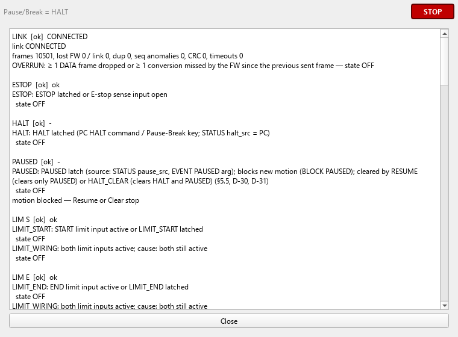

Latched names and their clear (Clear stop window, §1.5): `ESTOP` → **Clear E-STOP**; `HALT`, `PAUSED` →
**Clear HALT** / **Resume**; `LOAD_LIMIT`, `AFE_FAULT`, `STEP_FAULT`, `LIMIT_WIRING`, `HOME_NOT_FOUND`,
`HOME_WIRING`, `HOME_DRIFT`, `K1_WELDED` → **Clear faults**; `LIMIT_START` / `LIMIT_END` → move away (auto clear);
`LINK_WDG` → clears with the next frame.

The **Test Pause/Break key** window (Tools menu) arms a 10 s test: press the key and read the measured delay. During
the test motion is refused and the key does not send HALT.

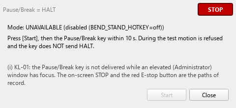

---

## 20. Appendix B — screenshot list
All in `03_SW/docs/img/`, regenerated with
`.venv\Scripts\python 03_SW\tests\gui\manual_screenshots.py` (offscreen, simulator, temporary data folder).

| File | Shows |
|---|---|
| 01_main_disconnected | main window at start |
| 02_connection_config | connected, board configuration |
| 03_first_use_banner | first use: motion refused |
| 04_confirm_no_specimen | C-10 no-specimen confirmation |
| 05_limits_no_specimen | no-specimen mode on |
| 06_confirm_home_under_load | C-01 homing confirmation |
| 07_manual_homed | Manual tab, homed |
| 08 … 10 | travel calibration wizard |
| 11 … 14 | load calibration wizard |
| 15, 16 | tare |
| 17_calibration_tab | Calibration & Tare tab |
| 18_limits_tab | Safety limits tab |
| 19_marks_tab | Test marks tab |
| 20 … 24 | plots, indicator bar, toolbar, readouts |
| 25 … 27 | sequence generator |
| 28 … 32 | sequence editor, start, run, pause, end |
| 33_report_tab | Report tab |
| 34_sequence_break_detected | BREAK_DETECTED guard |
| 35 … 38 | HALT and E-stop banners, Clear stop |
| 39_status_help, 40_hotkey_test | help dialogs |
